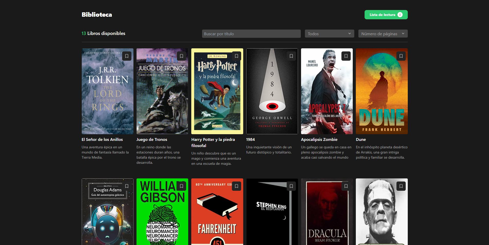

# vue-reading-list

The purpose of this project is to learn about Vue3 Basics, Pinia state managment and some basic stuff...  

Check the project on: [ReadingList](https://vue-reading-list.vercel.app/)  



## Project Setup

Install dependences  
```sh
npm install
```

Run dev server  
```sh
npm run dev
```

For testing with Vitest
```sh
npm run test:unit
```

Compile & prepare for production
```sh
npm run build
```

## Project tech stack

* Vite 4
* Vue 3
* Pinia
* Vitest
* Tailwind CSS
* Iconify
